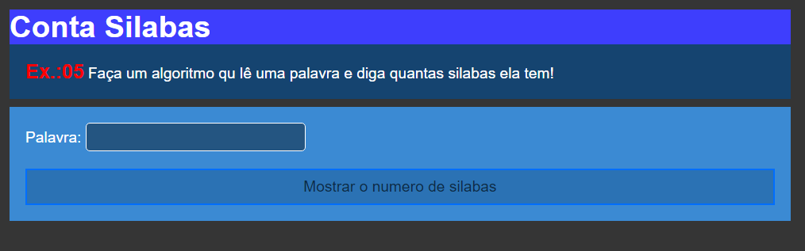
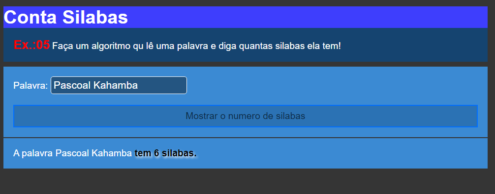

# Conta Silaba

Este projeto foi criado para fins de `exercício` em `Javascript`. Como o nome já diz tudo o projeto tem a função de contar `silabas` de uma determinada palavra.

## Tecnologias

As seguintes ferramentas foram usadas na constuição deste projeto:

- HTML
- CSS
- JAVASCRIPT

#

Feito por ❤ Pascoal Kahamba meu [Linkedin](https://www.linkedin.com/in/pascoal-kahamba-7b43bb233?lipi=urn%3Ali%3Apage%3Ad_flagship3_profile_view_base_contact_details%3BTg8LEKayToyytOX1pVAQ%2Bg%3D%3D)

[👉Clique aqui para rodar o projeto👈](https://meu-portfolio-delta.vercel.app/)😎
